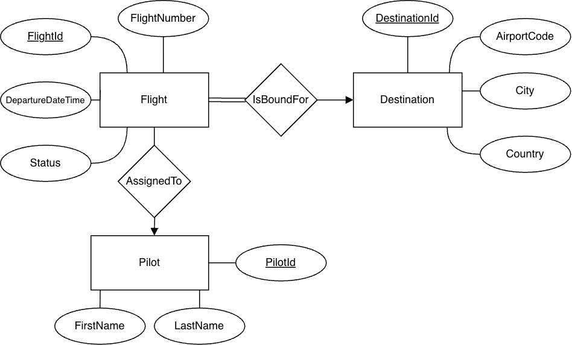

# Flight Management System

A command-line flight management system built with Python and SQLite3.

The application supports:
- flight creation and scheduling
- pilot assignment
- destination management
- flight searching and reporting
- aggregate database queries and summaries

## Requirements

- Python 3.x

No external packages are required.

## Running the Application

Start the application:

```bash
python main.py
```

Reset and reseed the database:

```bash
python main.py --reset
```

## Running Tests

Run all unit tests:

```bash
python -m unittest
```

## Database Features

The SQLite schema includes:
- primary and foreign key relationships
- `UNIQUE` and `CHECK` constraints
- indexed search columns
- aggregate reporting queries
- optional pilot-to-flight assignments

## Project Structure

```text
application/   Business rules and use cases
repositories/  SQLite queries and persistence logic
cli/           Command-line interface and display logic
database.py    Schema creation and seed data
tests/         Unit and integration tests
```

## Example Features

- Add and update flights
- Search flights by destination, status, or date
- Assign pilots to flights
- View pilot schedules
- Generate aggregate reports
- Manage destination records


## ER Diagram

The database contains three main entities:

- `Flight`
- `Destination`
- `Pilot`

Each flight is bound for one destination and may optionally be assigned to a pilot.

